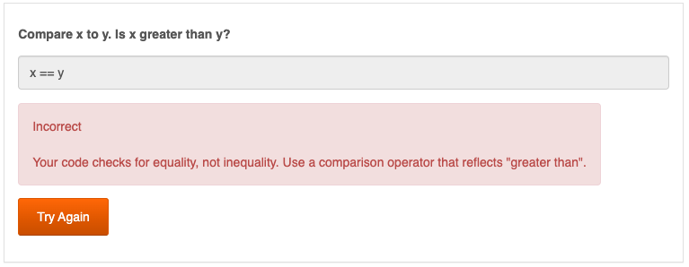

# ai4teaching


The `ai4teaching` package is designed to provide AI-powered,
instantaneous feedback to students either while working on asynchronous
assignments or as part of an AI-administered oral exam. It was built
with the [`learnr`](https://pkgs.rstudio.com/learnr/index.html) package
in mind, but it can be used outside of a `learnr` tutorial.

## Installation

`ai4teaching` can be installed with the following command from the
`devtools` package:

    devtools::install_github('johnsonra/ai4teaching')

## API keys

Most models currently implemented in `genAI_query` require an API key.
This can either be provided in the call to `genAI_query`, or `OPsecrets`
will try to find the API key if one isn’t provided. The [Usage](#usage)
section below has examples for providing API keys. The default
environmental variable names for each provider (e.g. Gemini, OpenAI,
Anaconda) can be found in the following documentation files:

    ?gemini_query

`OPsecrets` also supports the use of 1Password utility, `op`. Additional
documentation on how to set up 1Password’s `op` utility to work with
`OPsecrets` can be found [here](https://github.com/johnsonra/OPsecrets).

## Usage

### Generic queries

To submit a plain query using the default environmental variable, we
first need to define the variable, then make the call to `genAI_query`.

``` r
# this is not a real an API key - you'll need to provide your own
Sys.setenv(GEMINI_API_KEY = '123456-xyz')

genAI_query("What is 1 + 1?", model = 'gemini-1.5-pro')
```

    1 + 1 = 2

While this works, it is a bad idea to hard code your API key in your
file. If you want to permanently add your key to your R environment, you
can edit your default R environment with `usethis::edit_r_envrion()` and
add a new line (e.g. `GEMINI_API_KEY = '123456-xyz'`). This is a lot
better, but it is still stored in plain text on your filesystem.

Alternately we can include the key as an argument to `genAI_query`:

``` r
# again, this is not a real an API key - you'll need to provide your own
genAI_query("What is 1 + 1?", model = 'gemini-1.5-pro', api_key = '123456-xyz')
```

    1 + 1 = 2

This leaves us with the same problems discussed above. We will use
1Password for the remainder of this README (see [`OPsecrets`
documentation](https://github.com/johnsonra/OPsecrets) for more
discussion and examples). For example:

``` r
genAI_query("What is 1 + 1?", model = 'gemini-1.5-pro',
            api_key = OPsecrets::get_secret('GEMINI_API_KEY', 'Private', 'Gemini', 'api_key'))
```

    1 + 1 = 2

### Checking answers

This gets us only so far. When providing student feedback, however, we
want to provide a question, an answer, and sometimes we want to provide
a solution. We also don’t want the feedback to be something along the
lines of “No, that isn’t correct. The right answer is…”.

In order to provide feedback, we need to provide the question and the
student’s answer, along with a sample solution if desired (most large
language models won’t typically need a sample solution). For example:

``` r
check_answer("Given two variables, `x` and `y`, provide a line of R code that will check if `x` is greater than `y`",
             "x == y")
```

    Correct.  To make it more robust, you could wrap it in an `if` statement to explicitly handle the comparison result.

In the example above, the model affirms the solution is correct and
gives some additional feedback that might make the solution better. If
it is not correct, we would like the model to give us feedback without
giving the answer away. `check_answer` also includes a `preamble`
argument that instructs the model to give feedback rather than to
correct mistakes. The default preamble is

``` r
cat(construct_preamble())
```

    I'm taking a quiz. Let me know if my answer is correct. If my answer is correct, please begin your response with "Correct". If my answer is correct but could be better, please confirm and offer suggestions on how it could be better. Otherwise give me feedback on my answer. I want to know if I am on the right track. Do not give me the answer to the question. Keep your feedback brief and to the point - lets say 1-2 sentences.

See `?check_answer` and `?construct_preamble` for modifying the default
preamble.

### `learnr`

To incorporate this in a `learnr` tutorial, we can use `check_answer`
inside of `question_text` as follows:

    ```{r test_question, echo=FALSE}
    question_text("Compare x to y. Is x greater than y?",
                  answer_fn(function(value){
                    retval <- check_answer("Given two variables, `x` and `y`, provide a line of R code that will check if `x` is greater than `y`",
                                           value,
                                           model = "gemini-1.5-pro",
                                           api_key = OPsecrets::get_secret('GEMINI_API_KEY', 'Private', 'Gemini', 'api_key'))
                  }), allow_retry = TRUE)
    ```

When rendered in `learnr` an incorrect answer will look something like
this:



If we try again with the correct answer we get the following:


## Models

Below is a list of models that have been tested along with some
comments.

- Gemini: Additional (untested) models are available from Gemini, and
  they should work. See [Gemini
  documentation](https://ai.google.dev/gemini-api/docs/models/gemini)
  for a full list.
  - `gemini-1.5-flash`: Flash models, while free, tend to be overused
    and can not consistently be relied upon. The most common response
    you can expect from these models is ““, indicating the model is
    currently unavailable due to heavy use.
  - `gemini-1.5-pro`: Pro models are nearly always available and provide
    better feedback than flash models.

The following models are currently planned for development.

- OpenAI
- Anaconda AI-Navigator: this offers a number of open source models of
  various sizes as well as the option to run everything locally.
  - Gemma
  - Llama
